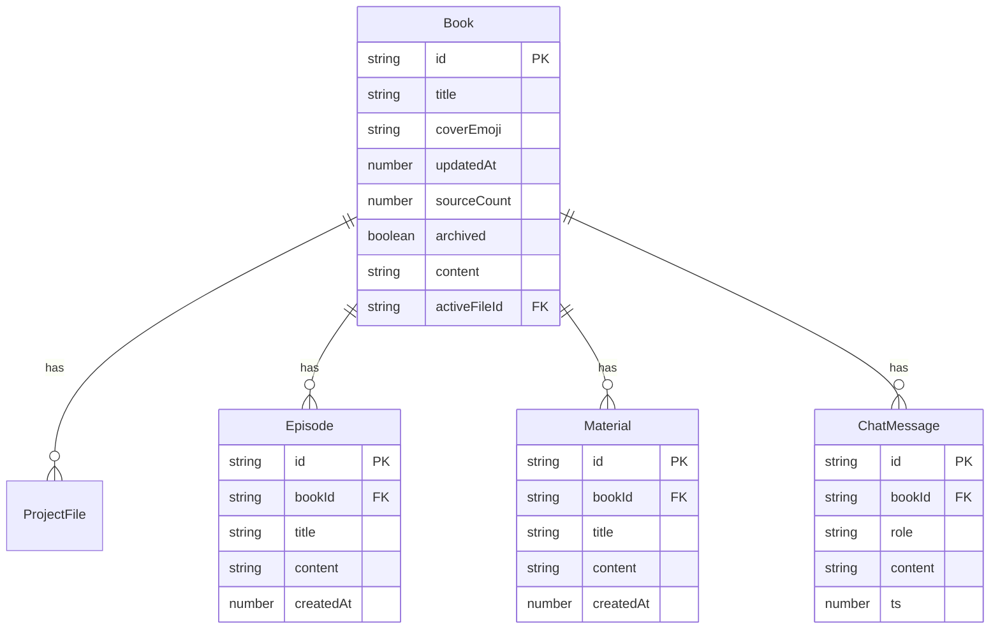

```mermaid
erDiagram
    Book {
        string id PK
        string title
        string coverEmoji
        number updatedAt
        number sourceCount
        boolean archived
        string content
        string activeFileId FK
    }

    Episode {
        string id PK
        string bookId FK
        string title
        string content
        number createdAt
    }

    Material {
        string id PK
        string bookId FK
        string title
        string content
        number createdAt
    }

    ChatMessage {
        string id PK
        string bookId FK
        string role
        string content
        number ts
    }

    Book ||--o{ ProjectFile : has
    Book ||--o{ Episode : has
    Book ||--o{ Material : has
    Book ||--o{ ChatMessage : has

```