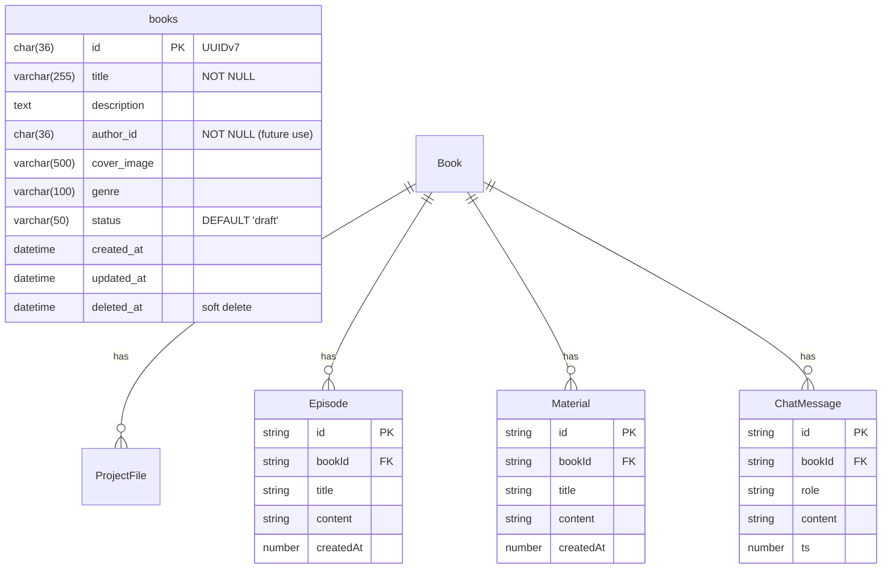

```mermaid
erDiagram
    books {
        char(36) id PK "UUIDv7"
        varchar(255) title "NOT NULL"
        text description
        char(36) author_id "NOT NULL (future use)"
        varchar(500) cover_image
        varchar(100) genre
        varchar(50) status "DEFAULT 'draft'"
        datetime created_at
        datetime updated_at
        datetime deleted_at "soft delete"
    }

    Episode {
        string id PK
        string bookId FK
        string title
        string content
        number createdAt
    }

    Material {
        string id PK
        string bookId FK
        string title
        string content
        number createdAt
    }

    ChatMessage {
        string id PK
        string bookId FK
        string role
        string content
        number ts
    }

    Book ||--o{ ProjectFile : has
    Book ||--o{ Episode : has
    Book ||--o{ Material : has
    Book ||--o{ ChatMessage : has

```