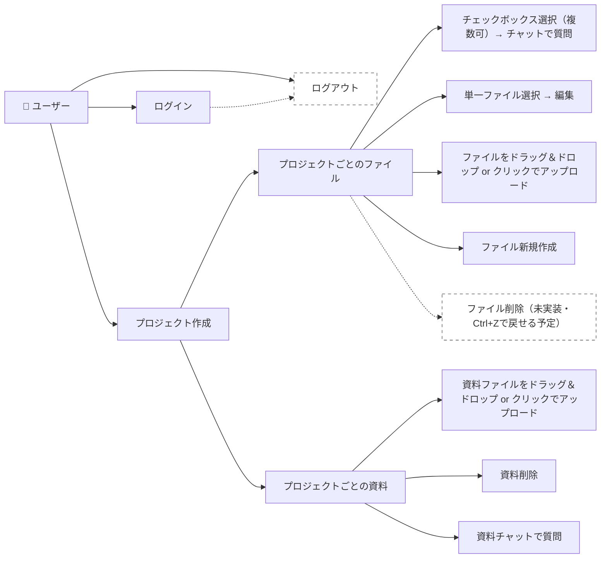

```mermaid
graph LR
    %% --- アクター ---
    User["👤 ユーザー"]

    %% --- ユースケース（上位） ---
    UC1["ログイン"]
    UC2["ログアウト"]
    UC3["プロジェクト作成"]
    %% UC4["辞書・表現検索"]

    %% --- プロジェクト内機能 ---
    UC5["プロジェクトごとのファイル"]
    UC6["プロジェクトごとの資料"]

    %% --- ファイル関連 ---
    UC5a["チェックボックス選択（複数可）→ チャットで質問"]
    UC5b["単一ファイル選択 → 編集"]
    UC5c["ファイルをドラッグ＆ドロップ or クリックでアップロード"]
    UC5d["ファイル新規作成"]
    UC5e["ファイル削除（未実装・Ctrl+Zで戻せる予定）"]

    %% --- 資料関連 ---
    UC6a["資料ファイルをドラッグ＆ドロップ or クリックでアップロード"]
    UC6b["資料削除"]
    UC6c["資料チャットで質問"]

    %% %% --- 辞書関連 ---
    %% UC4a["辞書表現を検索"]
    %% UC4b["補助チャット"]

    %% --- 関係 ---
    User --> UC1
    User --> UC2
    User --> UC3
    %% User --> UC4

    UC3 --> UC5
    UC3 --> UC6

    UC5 --> UC5a
    UC5 --> UC5b
    UC5 --> UC5c
    UC5 --> UC5d
    UC5 -.-> UC5e:::extend

    UC6 --> UC6a
    UC6 --> UC6b
    UC6 --> UC6c

    %% UC4 --> UC4a
    %% UC4 --> UC4b

    %% --- 拡張関係 ---
    UC1 -.-> UC2:::extend

    %% --- クラス定義 ---
    classDef extend fill:#fff,stroke-dasharray:5 5,stroke:#666;


```