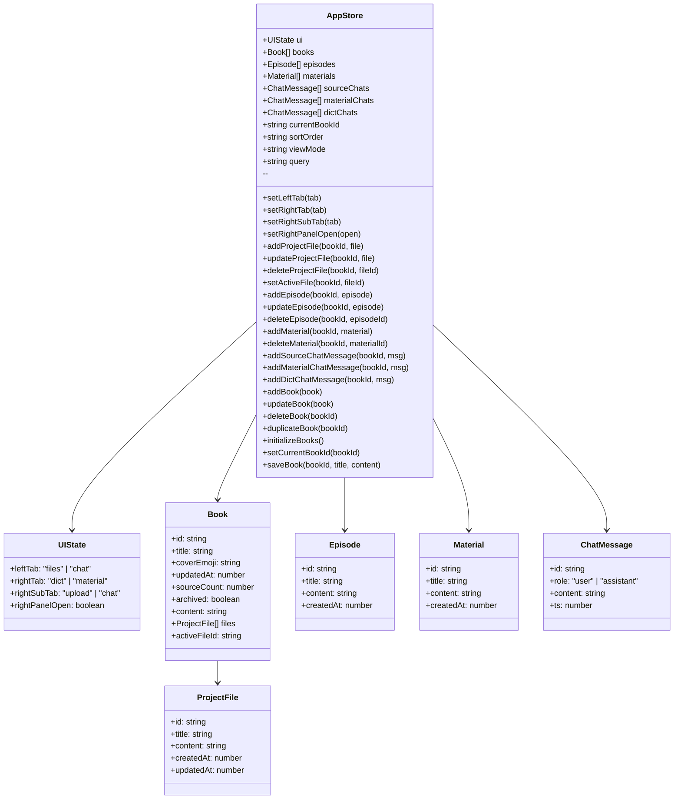

```mermaid
classDiagram
    class AppStore {
      +UIState ui
      +Book[] books
      +Episode[] episodes
      +Material[] materials
      +ChatMessage[] sourceChats
      +ChatMessage[] materialChats
      +ChatMessage[] dictChats
      +string currentBookId
      +string sortOrder
      +string viewMode
      +string query
      --
      +setLeftTab(tab)
      +setRightTab(tab)
      +setRightSubTab(tab)
      +setRightPanelOpen(open)
      +addProjectFile(bookId, file)
      +updateProjectFile(bookId, file)
      +deleteProjectFile(bookId, fileId)
      +setActiveFile(bookId, fileId)
      +addEpisode(bookId, episode)
      +updateEpisode(bookId, episode)
      +deleteEpisode(bookId, episodeId)
      +addMaterial(bookId, material)
      +deleteMaterial(bookId, materialId)
      +addSourceChatMessage(bookId, msg)
      +addMaterialChatMessage(bookId, msg)
      +addDictChatMessage(bookId, msg)
      +addBook(book)
      +updateBook(book)
      +deleteBook(bookId)
      +duplicateBook(bookId)
      +initializeBooks()
      +setCurrentBookId(bookId)
      +saveBook(bookId, title, content)
    }

    class UIState {
      +leftTab: "files" | "chat"
      +rightTab: "dict" | "material"
      +rightSubTab: "upload" | "chat"
      +rightPanelOpen: boolean
    }

    class Book {
      +id: string
      +title: string
      +coverEmoji: string
      +updatedAt: number
      +sourceCount: number
      +archived: boolean
      +content: string
      +ProjectFile[] files
      +activeFileId: string
    }

    class ProjectFile {
      +id: string
      +title: string
      +content: string
      +createdAt: number
      +updatedAt: number
    }

    class Episode {
      +id: string
      +title: string
      +content: string
      +createdAt: number
    }

    class Material {
      +id: string
      +title: string
      +content: string
      +createdAt: number
    }

    class ChatMessage {
      +id: string
      +role: "user" | "assistant"
      +content: string
      +ts: number
    }

    AppStore --> UIState
    AppStore --> Book
    Book --> ProjectFile
    AppStore --> Episode
    AppStore --> Material
    AppStore --> ChatMessage
```